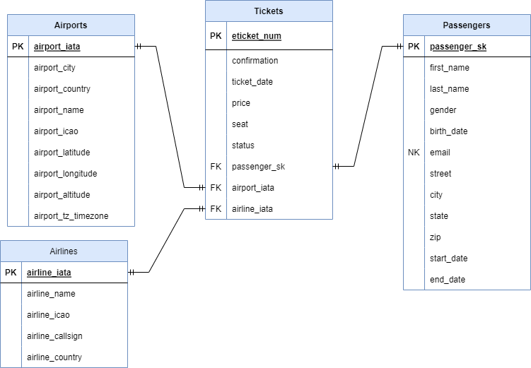

# Data Modeling

#### By Chloe (Yen Chi) Le

#### Create data model and ETL Pipline

## Technologies Used

* Python
* Jupyter NoteBook
* SQL
* Github
* VS Code
* BigQuery
* Google cloud
* Draw.io

## Description

In this repo, I'm trying to create data model and ETL pipeline for the tickets.json file.

The data is used for this project can be found under [`data/tickets.json`](./data/tickets.json)

This is the data model for ticket folder.

## Setup/Installation Requirements

* Open the terminal and navigate to where you want to save the project
* git clone https://github.com/ChloeL6/data-modeling.git, to save a copy of the project
* Do all the steps below to make and activate virtual environment, install all of the requirements and open the repo in VS code
    * python3.7 -m pip install --upgrade pip setuptools 
    * source venv/bin/activate
    * pip install -r requirements.txt
    * code .
* After VS Code open, go to main.ipynb to see codes for creating datasets and table

## Known Bugs

None

## License

Copyright (c) [2022] [ Chloe (Yen Chi) Le]

Permission is hereby granted, free of charge, to any person obtaining a copy of this software and associated documentation files (the "Software"), to deal in the Software without restriction, including without limitation the rights to use, copy, modify, merge, publish, distribute, sublicense, and/or sell copies of the Software, and to permit persons to whom the Software is furnished to do so, subject to the following conditions:

The above copyright notice and this permission notice shall be included in all copies or substantial portions of the Software.

THE SOFTWARE IS PROVIDED "AS IS", WITHOUT WARRANTY OF ANY KIND, EXPRESS OR IMPLIED, INCLUDING BUT NOT LIMITED TO THE WARRANTIES OF MERCHANTABILITY, FITNESS FOR A PARTICULAR PURPOSE AND NONINFRINGEMENT. IN NO EVENT SHALL THE AUTHORS OR COPYRIGHT HOLDERS BE LIABLE FOR ANY CLAIM, DAMAGES OR OTHER LIABILITY, WHETHER IN AN ACTION OF CONTRACT, TORT OR OTHERWISE, ARISING FROM, OUT OF OR IN CONNECTION WITH THE SOFTWARE OR THE USE OR OTHER DEALINGS IN THE SOFTWARE.